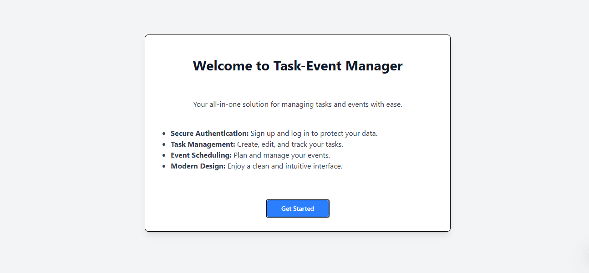
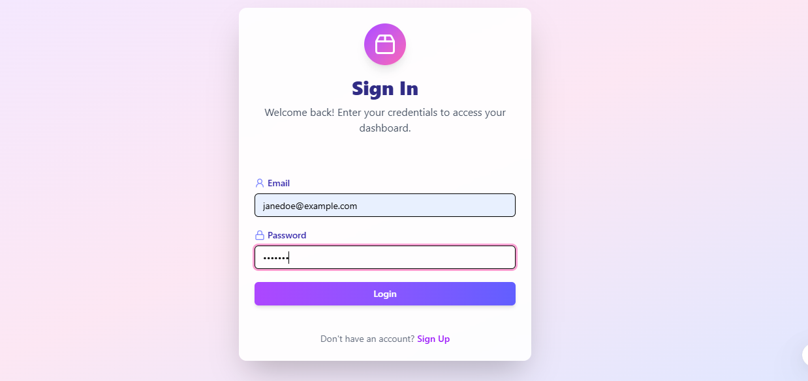
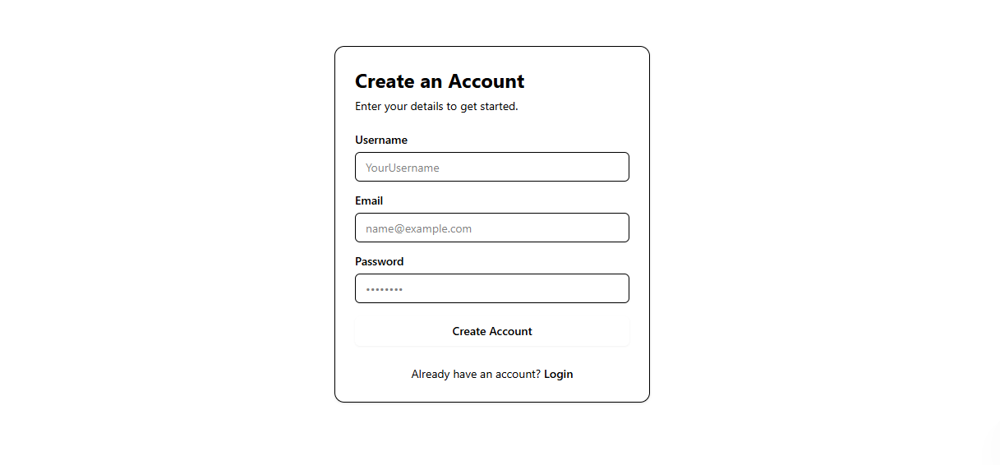
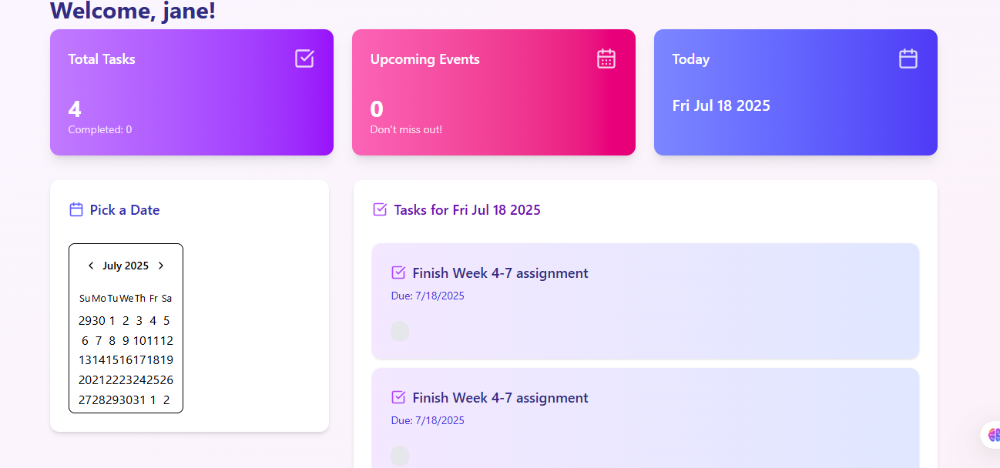
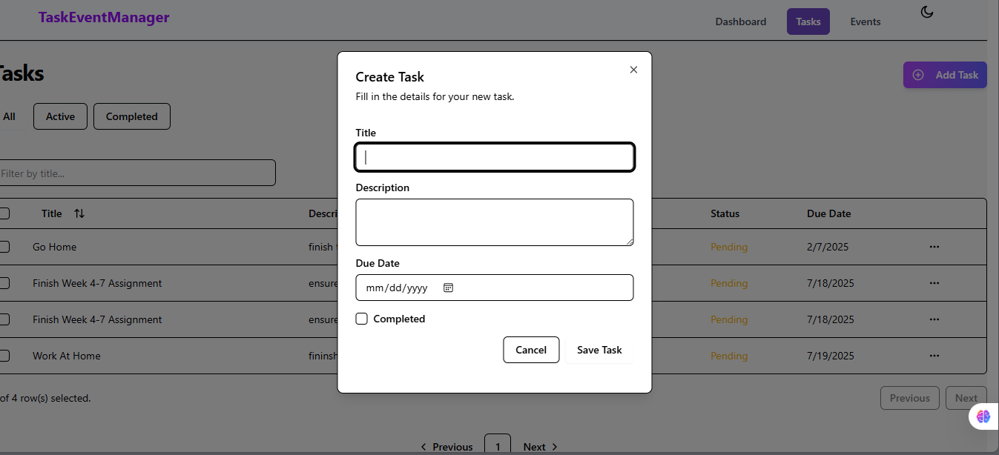
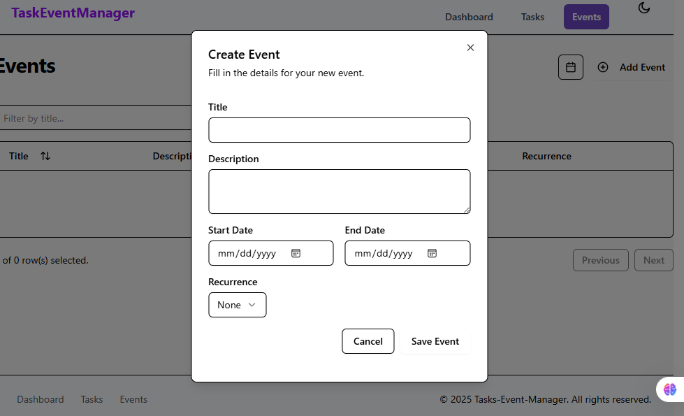

# Task-Event Manager

A full-stack application for managing tasks and events, built with React.js, Tailwind CSS, Node.js, Express, and MongoDB. The app features real-time updates, authentication, and a modern, responsive UI.

---

## 🚀 Introduction

**Task-Event Manager** helps you organize your daily tasks and schedule events efficiently. It supports user authentication, CRUD operations for tasks and events, and real-time updates using Socket.IO. The UI is built with reusable components and styled with Tailwind CSS for a seamless experience on any device.

---

## ✨ Features

- User authentication (sign up, login, JWT-protected routes)
- Create, read, update, and delete tasks
- Create, read, update, and delete events
- Real-time updates for tasks and events (Socket.IO)
- Responsive design with Tailwind CSS
- Modern UI with dialogs, dropdowns, and notifications
- Error handling and form validation

---

## 🖼️ Screenshots

### Home Page


### Sign Up


### Login


### Dashboard


### Create New Task


### Create Event


---

## 🛠️ Getting Started

1. **Clone the repository:**
   ```bash
   git clone <your-repo-url>
   cd <your-repo-folder>
   ```
2. **Install dependencies:**
   ```bash
   npm install
   # or
   pnpm install
   ```
3. **Start the backend server:**
   ```bash
   cd Tasks-Event-Manager/backend
   npm install
   npm start
   ```
4. **Start the frontend app:**
   ```bash
   cd ../frontend
   npm install
   npm run dev
   ```
5. **Open your browser:**
   Visit [http://localhost:5173](http://localhost:5173) (or the port shown in your terminal)

---

## 📁 Project Structure

```
Tasks-Event-Manager/
├── backend/           # Express.js API, MongoDB models, controllers, routes
├── frontend/          # React app, pages, components, hooks, context
├── screenshots/       # App screenshots for documentation
└── README.md          # Project documentation
```

---

## 🧰 Technologies Used
- React.js
- Tailwind CSS
- Node.js & Express
- MongoDB & Mongoose
- Socket.IO (real-time updates)
- Axios
- Zustand (state management)
- React Hook Form & Zod (form validation)

---

## 👤 Author
**Cpt. Njenga**

---

## 📄 License
This project is for educational purposes. 